---
title: "Artists aren't doomed, quite yet"
date: 2022-9-10
author: Christopher Kempke
description: There's a new generation of artificial intelligence-based art generators.
tags: 
  - artificial intelligence
  - technology
...

# Artists aren't doomed, quite yet

## So, computers can do art, now?

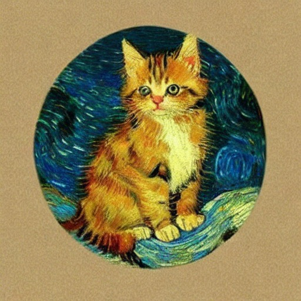

In the last few weeks, mainstream news has started covering synthetic art generation systems—Artificial Intelligence systems that can "learn" about various art techniques, artists, forms, subjects, and the like, then generate new, original creations based on either a provided "starter" image or, more interestingly, a simple text prompt.     The general public awareness of this was probably prompted by a story about an AI-generated artwork winning an art competition; more technical sources have been talking about these AIs for several months now.

There are several of these around: MidJourney and Stable Diffusion are two of the most discussed, but there are several more.   Most have some mechanism by which the general public can try them out, but at the moment they usually require acquiring a bit (or a lot) of technical knowledge.   They tend to be driven by command lines, scripts with many complex dependencies, or weird notebook-like things.  MidJourney can be invoked by Discord channel.     

If you want to try them out yourself, you won't have a long wait.  There are numerous projects working on creating installable, GUI-based versions of these tools.  Several probably exist already if you look around hard enough.

Whichever of the sources you use, they work in similar ways.  They're fed a massive library of captioned images (typically selected from the Internet), and based on analysis of these images and their captions, they start learning what attributes go with what captions.   Given enough source material (and "enough" here is very large: hundreds of thousands at a _minimum_), they can start to invert the process and construct entirely new images based on text prompts.    They can mimic particular art styles or even particular artists, and (at least where the subjects are sufficiently present in the input set) a vast array of different subjects.

Need a kitten in the style of Vincent van Gogh?  You might get the image at the top, or maybe this one:

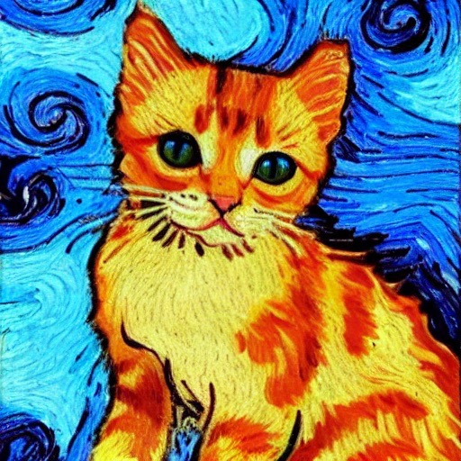

Which is kinda slick, but you might also get THIS one:

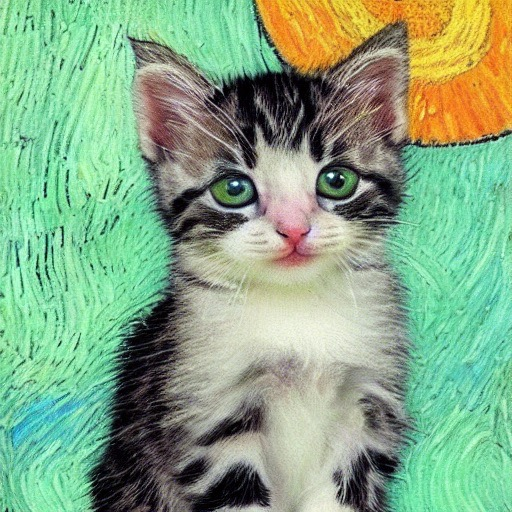

That's pretty much just a photo of a kitten pasted over a van Gogh background.

Reaction among artists ranged from amusement to alarm, with many foretelling the end of human artists altogether.  (This was also predicted at the invention of the camera, digital cameras, television, video, photoshop, the printing press, and probably most other inventions throughout history).

Is that likely?   Maybe.   But it hasn't happened yet.

A quick note:  There are several of these AI generators, and they use different code, training models, interfaces, etc.    They have their individual strengths and weaknesses.   The images in this post all come from Stable Diffusion.

## How many tails does the average wolf have, again?

In order to get those three example images, I produced about twenty.   And that's for kittens.   With the possible exception of pornography, it seems likely that there are more pictures of cats on the Internet than any other subject.    And Vincent van Gogh is probably one of the five or so most common names you'd get if you stopped people on the street and asked them to name a famous historical painter.      And even given these subjects--which likely appeared prolifically in the training sets, it generates far more trash than treasure.

Realistic subjects are particularly bad:  look carefully at that kitten "photo" above.  What the heck happened to its legs?   Here's one of the _better_ images from "a large gray wolf running through a pacific northwest forest:"

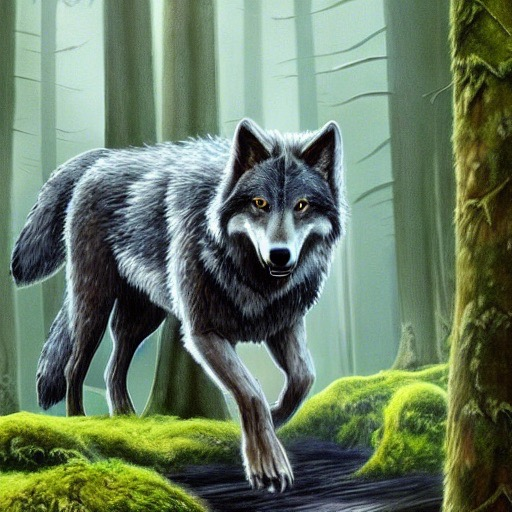

And that's not an exception.  I have _never_, in thousands of images, gotten realistic humans who don't have missing or extra limbs, weird bodily contortions, random numbers of fingers, and the like.   It does better with mere faces, but even then you get an awful lot of impossible ones for every good image.    And it likes adding humans even when you didn't ask for them:  "An abstract piece of feudal japanese art" gave me this gem:

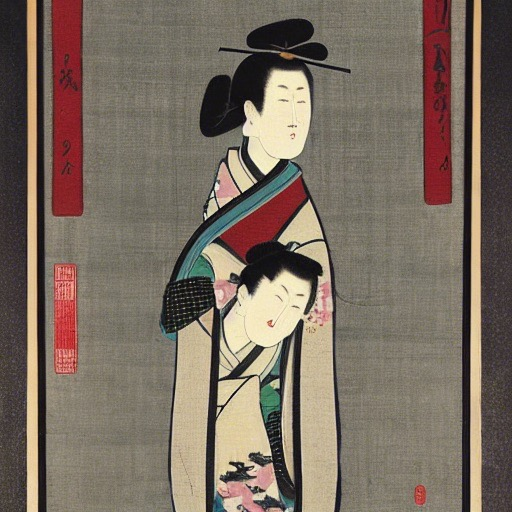

I don't even want to know what training set produced that.   

Landscapes and abstractions seem easier for it.  "A river flowing through an ice cave" produced several very nice images, even if they didn't match the prompt very well.

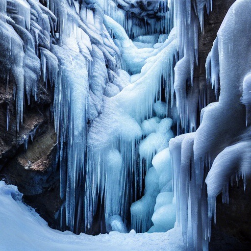

If you look at that closely, there are some shapes that don't make good "sense," but it's a perfectly usable image.  As a background for some fantasy adventure, it wouldn't raise an eyebrow.  Under the right circumstances, you might be able to pass it off as a photograph.

Let's add a "a dragon resting" to our ice cave:

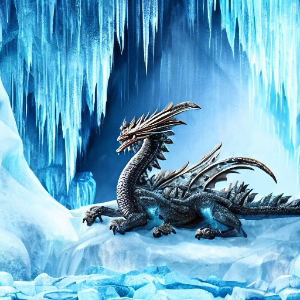

Don't look too closely, and that image passes pretty well, too.   Although the dragon has a weird body shape.  We'll come back to dragons, later.

I am, apparently, not using very good prompts for most of these.    There's an, ah, "art" to crafting good prompts, and you'll find references online that can give you help.    One reference I used while installing Stable Diffusion suggests this as a test prompt:

"a beautiful dense amazon forest with tall trees and thick cannopy, moss on tree trunks and rocks, big rocks on the ground, a lonely boy stands staring into the path that leads into the forrest, trending on Artstation"

Letting it produce only _one_ image with that prompt, we get this in about 45 seconds:

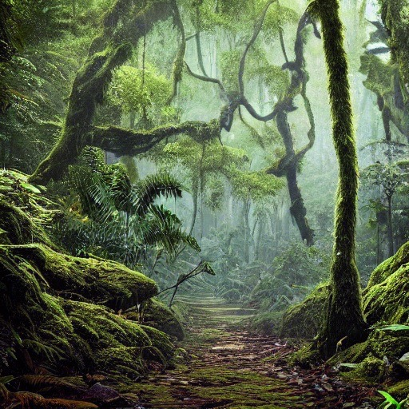

There's no "lonely boy" visible in that image, but it's otherwise pretty good.   Many of the suggested prompts you see online have things like "trending on (some social media or art site)" or "as imagined/painted by (known artist)" or a specific style specification.   Nearly all have lots of adjectives, multiple small descriptive clauses, and few relationships (on/in/next to).

And right now, that seems to be the state of AI image generation.   Far from replacing artists, we seem to have developed a new "prompt crafting" art form requirement.   And even then, we need an awful lot of human curation:  The jungle scene above was a first image, but usually you need to generate tens or hundreds of them to get one really good one.

## Originality?

And even when you do, I'm uncertain as to the level of originality being presented.   For example, back to the dragons.    When fed some prompts of the "a dragon in (place) ..." for several different places, I got about 200 images, which contained all of these:

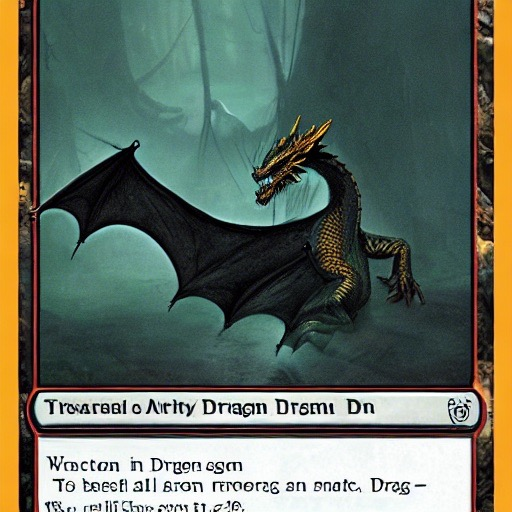{width=256}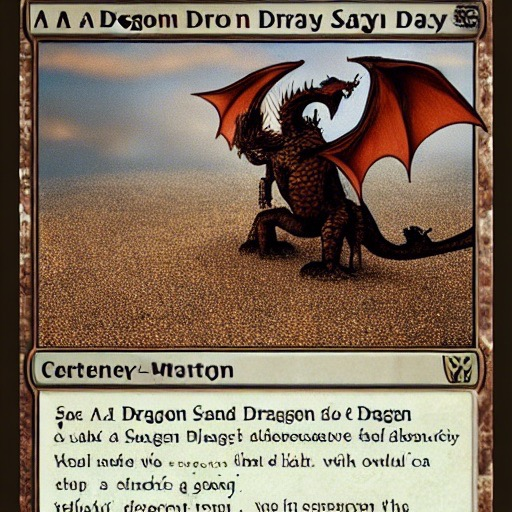{width=256}{width=256}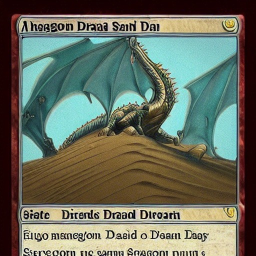{width=256}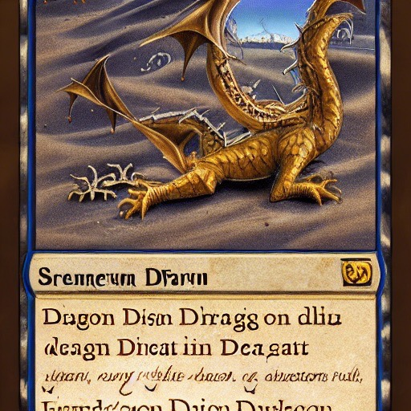{width=256}

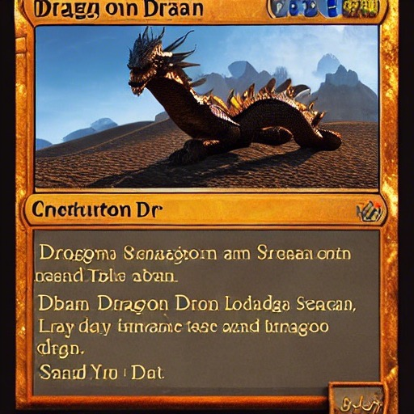{width=256}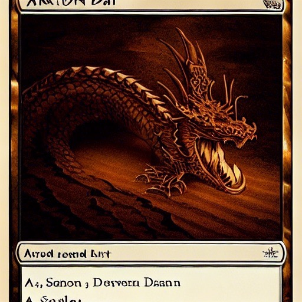{width=256}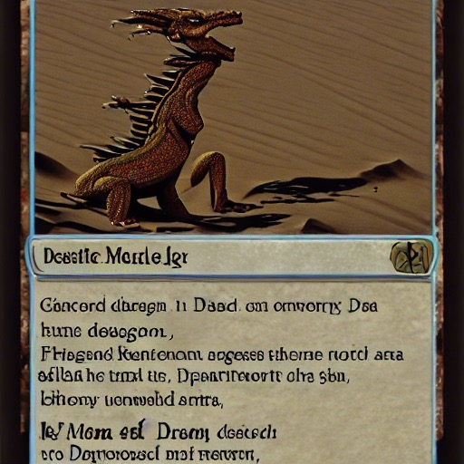{width=256}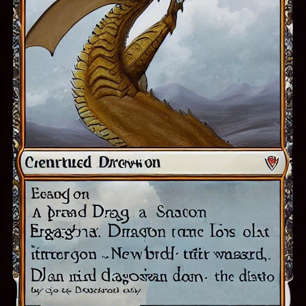{width=256}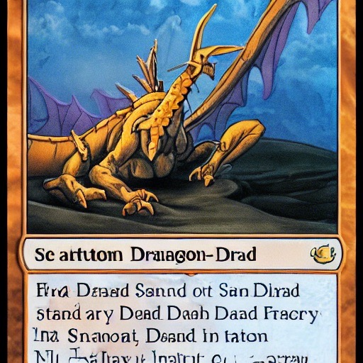{width=256}

Those are based on collector cards from Magic the Gathering or some similar collectable card game, so close to the originals that individual words and numbers are sometimes legible in them.   And they made up about eight percent of my output.

There are a couple possibilities, here.   

- (A) For each of those "synthesized" images, a single, specific source made up the bulk of the image.  In other words, less of "image synthesis,"
  more of "some sort of hallucinogenic search engine."    
- (B) These card formats are so distinctive in style that they effectively make up an "art style" of their own, and these actually _are_ more or less completely original images, just presented in a "MTG Card" style which will have future art historians writing dissertations about the importance of saving throws in mid-21st-century discourse.

That's a big difference, and it might be important to know which is it.   In part, this is because of a quirk of copyright law:  images not produced by humans are in the public domain.  But if you can just "use an AI" to copy something and magically turn it into public domain art, it's unlikely that rights holders will allow that state will persist long. 

So, which is it? Short answer:  I don't know.   Given the vagaries of how these sorts of machine learning models work, it's possible that nobody knows.    Machine Learning doesn't always give you good explanations for "why did you choose this answer?"  (Although they can: consider the "Why are you showing me this?" button on many recommendation engines.)

But what technology taketh away, technology can also giveth.   It's possible to do sort of the "reverse" trick, using either [Bing Visual Search](https://www.bing.com/visualsearch) or Google Image search (just go to Google, click on "Images", and then click on the camera in the search box).    Both of these are a sort of "search by visual similarity" engine for the web.

My theory, here, goes a little like this:  These AI tools were generated using training sets from the Internet.   If case (A) is correct, and we're just getting back heavily distorted versions of some unique original, then it's likely that a reverse image search on the _result_ might find the original image.

Like many of my theories, it doesn't work.   Neither engine finds particularly close matches to any of these cards, for particular definitions of "particularly close," anyway.   These collectable card games are seemingly obsessed with dragons and dragon-like creatures to the point where there are _thousands_ of "some sort of dragon in one of these card frames" images out there.     

*Side Note:  For this particular case, and in general when I've used it, the Bing engine is overwhelmingly better at producing "close" images than the Google one is.   Bing generated almost all "card" images, Google didn't have any in the first couple pages.   I have no idea why.   Google also figured out that my kitten images were kittens and gave me lots of them, but Bing not only saw "kitten", but also "Van Gogh Style" in its results.*

I'd hoped to find a smoking gun card -- one which matched most of the text and significant parts of the image.    I didn't find that for any of my "generated" cards, on either search engine.

So does that tell me that (B) is a better explanation, or just that the "visual similarity" algorithms used by these engines isn't good at unravelling the distortions of case (A)?    Again, I have no idea.

## Back to the Future

In 2004, DARPA had a contest for self-driving vehicles.  A few dozen teams competed to navigate a 250 km course across a desert with no human intervention.

It was a triumph for humanity—in the sense that we had nothing to fear from the robots.  None made it even 5% of the distance.   Many barely got off the starting line.  Skynet was permanently and forever ruled out.

Jump forward a mere 18 months.  In late 2005, the same challenge was run again, but the results were...different.  Many of the vehicles navigated the entire course.  All but one did better than _all_ of the previous year's contestants.   Everyone named Sarah Connor within the test area was forced to flee.

All science and engineering probably used to be this way, massive leaps in understanding, explanation, and general knowledge every few months or years—when they were new.    But most of our science and engineering disciplines are hundreds of years old, now.    Not computer science, and not A.I.   Right now, we're in the "rapid discovery" part of virtually every technological field.    Sure, the latest iPad may not seem all that innovative compared to the previous model, but a mere fifteen years ago, a computer less than a half inch thick that you could hold in your hand would have been borderline magic.   Twice that long ago and the idea that you could have such a device--and on it watch effectively every television show and movie ever made, without requiring it to even be plugged in, in a resolution indistinguishable from photographs, weighing about a pound, and inexpensive enough that almost everybody could have one?...well, it would have been beyond laughable.   Nobody would believe it even as science fiction.

So while our short term future may be of single-pawed kittens, multi-tailed wolves, and humans that look like the result of a fire in a wax museum, I suspect that this reprieve will be short-lived.   Give 'em a year to refine the algorithms, a few million more images for the training sets, and I suspect we'll be looking at a DARPA 2005 situation.

Not that we need to wait until then to ask the big question.   Really, the one we've been asking since we started scratching on cave walls.

*Is it art?*