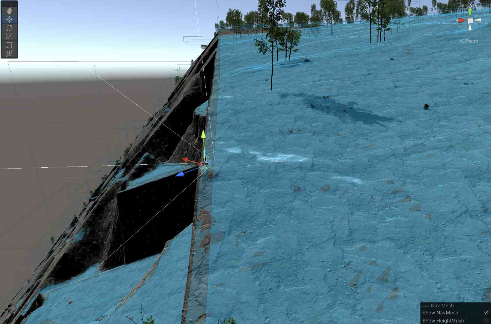
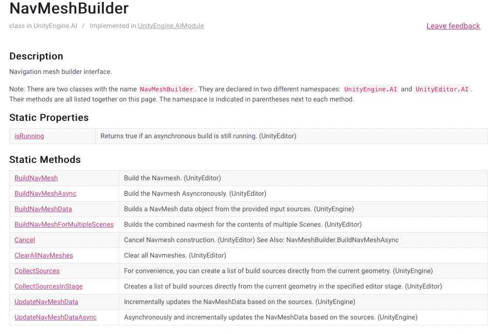

# Asynchronous Runtime Navmesh Generation in Unity

Buckle in, boys and girls.  This one's going to be a ride.

I've recently started trying to add monsters to the world I'm creating over in my [Unity Procedural Terrain](https://ckempke.github.io/UnityTerrainGeneration) system.   I'd like to use the **NavMesh** system for enemy AI, but since my terrains aren't created in the Unity Editor, but rather randomly at runtime, I need to be able to create the **NavMeshes** for my monsters at runtime.

And thus began the rabbit hole.   It became quickly obvious that _it could be done,_ but equally obvious that there wasn't really a good known solution out there, particularly one that was performant enough to use in a runtime environment where terrains were being created and destroyed at a reasonably fast cadence as the player moves around a large open world.

As every Unity developer knows, the Unity documentation is sort of like the Evil Stepmother of fairy tales: keeping up an appearance of caring about you while secretly undermining any chance you've got for success, and possibly actually poisoning you.

> [Author's Note] If anyone at Unity is reading this, _please_ consider hiring me to come in and try and clean up some of that documentation, particularly the scripting side.   Some simple rules and standards could make it infinitely more useful for actual developers.

So I've dug into this, and it turns out that it's not actually as horrifying as it initially seems, although there's a few caveats.    Let's see if we can clear it up a bit.

## Background

Unity provides a built-in AI Navigation system for 3D games.   This allows 3D entities to figure out where they can "walk," and provides automatic pathing, obstacle avoidance, patrol points, target tracking, and the like.   It's not going to pass the Turing test any time soon, but for many games it provides a moderately sophisticated level of "enemy" AI for relatively little effort.

The two major components of this system are the **NavMesh** and the **NavMeshAgent**.

### NavMesh

**NavMesh** is a property of the **Scene**.   You can think of it as a sort of invisible carpet that covers the scene in places where an entity of a given size can walk.   That is, it'll be all over the floor except right next to walls or under doors and arches that the entity is too large to pass through, or on slopes too steep for that entity to walk up.

You can visualize a **NavMesh** in a scene by:

- Opening the Navigation Inspector (Window->AI->Navigation).  You need to have the inspector active in order to see **NavMeshes**.
- Go to the Scene View
- Turn on Gizmos (either all of them, or the specific ones for Navigation AI).
- Move your viewpoint close enough to the mesh (navmeshes clip out after a few dozen units).

If you've done all that—and there's a **NavMesh** created for the **Scene** at all—you should see a sort of blue layer across your walkable areas.



Note that the **NavMesh** is pretty smart:  it doesn't allow you to "walk" on the cliff faces or steeper areas, and avoids the larger rocks (though not the trees in this case).   The image above actually shows _two_ overlapping **NavMeshes**:  one for fairly large entities (giants and such), and one for human-sized ones.   You can see the difference particularly along the straight cliff edge, where smaller entities can approach much closer than large ones.    Note that the **NavMesh** indicates where the _center_ of the entity can travel, which is why it doesn't go right to the edges.  (That screen shot is from a significant distance from the player in the center.)

The **NavMesh** typically is built for "walkable" areas, although you have a great deal of flexibility in its creation.   For example, you can mark certain areas as "walkable, but harder," like mud, sand, or shallow water.   The AI system will assign these areas higher cost, allowing the navigating to be "smart" about whether to walk through such an area or go around.    It's also possible to add meshes with different "up" orientations, such as for spiders that can walk on walls or ceilings (linking them with "off mesh links").

You can't see it here because the distances are too large, but the **NavMesh** will also intelligently create "jump" points, where an entity cannot walk because of steepness or interrupted ground, but could safely jump up, down, or over.

There are some other capabilities present, as well: the ability for meshes to connect to other meshes via physical joints or outright teleportation, and the ability to make anti-meshes (non-walkable areas) and the like.  We won't be using those today.

Finally, we need to note the difference between a **NavMesh** and a HeightMesh.   **NavMeshes** are approximations to the surfaces they describe; in particular "stairs" and other steps tend to get smoothed out into ramps.   This doesn't matter for the purposed of navigation, but it can make your entities sort of "float" above the ground if they're placed directly on the mesh.    HeightMeshes are a similar process, but they're more expensive to build and follow the ground more or less precisely (each stair will be flat, for example).     The system I'm describing here makes only NavMeshes, so you may need to tweak monster positions a little bit in order to make them stick to the ground.

*Ultimately NavMeshes describe connectivity*:  Our entity can move from any blue area to any connected blue area, jump from one blue area to another across paired jump zones, and not move at all through non-blue areas.

One final tip here:   You can turn on NavMesh gizmos in the Game view as well as the Scene view.   This is horrible for performance; your frame rates will drop precipitously.   But it can be useful to occasionally check the meshes from the "point of view" of the player.    It's also generally easier to see the height offsets between the actual ground and the approximating NavMesh in Game view.

### NavMeshAgent

The other half of the equation is the **NavMeshAgent**.   This is a component that's placed on the gameobject representing the moving 3D entity.   It describes the entity's size and movement characteristics, things like:

- Height
- Width (technically "radius" of an implicit capsule collider)
- Turn speed in degrees/second
- How high the agent can step
- How steep a slope the agent can walk up
- Speed, acceleration, and stopping distance

The **NavMeshAgent** also includes an "Agent Type ID", which is defined in the *Navigation* window's *Agents* tab.  This duplicates several of the other properties (height, radius, step size, slope), and I'm not at all sure why you have to specify both, since if they don't match, the **NavMeshAgent** won't work.   We'll encounter the Agent Type under another name: "Build Settings" later in the process.    

*We will need to generate one NavMesh for every Agent Type that will walk on it.*  Since it's expensive to make these (in both memory and computation time), you'll likely want to bucket all of your entities into 2-3 different agent types (or just one, if everybody's human), even if that means some of the sizes won't match exactly.  (This doesn't apply as much if you're baking in the editor where time doesn't matter, but they still take up a fair amount of memory.)

From scripts, we can access the agent in the usual way we access any component:

```C#
NavMeshAgent _navMeshAgent = gameObject.GetComponent<NavMeshAgent>();
```

Once you've got the agent, you can set a destination with `SetDestination(<Vector3>)` and override the speed, acceleration, turn rate, etc. if you like (if you don't, they'll use the ones defined in the agent itself).  The Vector3 passed to "destination" ignores the Y value unless the NavMesh overlaps itself in 3D.

We actually turn it on by telling the agent it should no longer be stopped:

```C#
_navMeshAgent.isStopped = false;	
```

(You also need the usual stuff like making sure the component is enabled and active.)

At this point, one of two things will happen:  The agent will start to move the gameObject toward the destination (it controls facing and movement, things like animation are up to you), or you'll start getting tons of error messages about "<Various Functions> can only be called on an active agent that has been placed on a NavMesh."

Let's ignore the errors for a moment.   Assuming your agent is moving your gameObject, you can then use the `remainingDistance` property on the NavMeshAgent to figure out how far the agent is from its destination (say, to give it another waypoint on a patrol route.).   There are two caveats with `remainingDistance`:

1) It will return 0 when the agent can go no farther.   This doesn't necessarily mean that it's at the destination you originally specified, just that it's as close as the NavMesh allows to that point (which could be quite far away, if you specified a someplace way off the mesh).
2) If the agent can't move in a straight line to the destination, it tends to return `Infinity` while it traverses a path, up until the last "leg."  Once it's just on a straight-line route to it's destination, it'll start giving real numbers.

Both of these mean that you'll not want to rely on `remainingDistance` for things like "time to destination" calculations, because they'll be as random as a Windows download progress bar.   Generally you care if it's very near zero or if it isn't.   (It actually seems OK to test for exactly zero, but I've got 45 years of experience telling me to be skittish about exact equality tests on floating point numbers.)

You don't need to wait for it to reach a destination before assigning a new one.  For example, if it's chasing a player, you can give it the player's position as the destination every few frames.

### NavAgent "active agent ... placed on a NavMesh" Errors

OK, back to those errors.  In what's probably the biggest understatement in this post:  NavAgents are very picky about their placement on a mesh.

Very picky.

Unbelievably picky.

As with many of these sorts of things, a sort of mythology develops, as devs find their superstitious practices that "fix" the problem:  The position needs to be exactly on the mesh.  The feet of your model need to be exactly on the mesh.    The model needs a capsule collider of exactly the mesh's agent size.   The agent needs to be disabled and then enabled again.   The "Lord of the Rings" needs to be playing on the TV while you code.

The capsule collider thing may be true.  Some of the others might work, too, but especially if we're going to be moving these things at runtime on **NavMeshes** that come and go, we need to have a more reliable way of  insuring it.

There first thing to check is `_navMeshAgent.isActiveAndEnabled`.  If that returns false, either the gameObject has been set to inactive or the **NavMeshAgent** component on it is disabled.   These are both pretty standard checks for weird Unity behaviors.

Next up, we can actually test if the agent is "really" on a mesh by asking it.   `_navMeshAgent.isOnNavMesh` returns *true*, then the agent is properly placed on a **NavMesh** compatible with its agent.   In this case, you should be good to go, and you won't get the "active agent..." errors for that particular game object.

But what if `isOnNavMesh` returns *false*?

First off, verify that the Agent Type selected for the agent is compatible with the NavMesh that you believe it to be on.   If you only create the "humanoid" NavMesh, and you've got a non-humanoid agent, it'll never work.

Otherwise, we should be able to fix it.

There's two pieces of "magic sauce" here.   One of them its the `NavMesh.SamplePosition` function.  Note that this is a class ("static" ) function on NavMesh.   All of NavMesh's user-accessible functions are static; which means—among other things—that our options for moving it off-thread will be limited, later.

`SamplePosition`() works a lot like `Physics.Raycast()`.  It takes a starting position, tries to find the nearest NavMesh point from it, and returns that value if it works.

So:

```C#
 if (NavMesh.SamplePosition(transform.position, out NavMeshHit hit, 8f, 1))
 {
  // "hit.position" now contains a valid position on the mesh
 }
 else
 {
  // We're not close enough to a valid mesh position, do something else
 }
```

The arguments to `SamplePosition` are

- The "test" position, probably the location of your gameObject itself.
- An *out* parameter of type NavMeshHit to hold the valid point (if any)
- The greatest distance to look.   The manual suggests that this should be limited to twice the height  of the agent or else the test starts getting expensive, so "8f" may well not be the right value for you.  That said, I suspect that "twice the height" is a typo, and they mean "twice the radius," since I don't understand how height would have anything to do with it.
- An "area mask" for what part of the NavMesh you want to look at.   "1" here is the area mask for "Walkable", which is often what you want.  Alternatively, "0xFFFF" (or better, the constant `NavMesh.AllAreas` ) will give you an area mask with all bits set, which will find allow you to find valid jump points, high-cost walking areas, etc.   If your NavMesh has a complex mix of areas, you can be as specific as you want.   Look up the area number in the Navigation window, and left-shift "1" that many times to set a bit in the mask.  (For example, if you want area "3", you'd use `1<<3`.  If you want area "3" and area "0", use `1<<3 | 1<<0`, and so on.   You may have encountered this before with layer masks, which work the same way.)

If `SamplePosition` returns false, you're out of luck.  If you are placing your "monsters" randomly, this one's likely in a position that's not walkable or reachable, outside the NavMesh area, or there's no current NavMesh at all.   You'll need to determine what to do about it.  If this is an initial random placement, try placing somewhere else.   There's an example in the [documentation for SamplePosition](https://docs.unity3d.com/ScriptReference/AI.NavMesh.SamplePosition.html) that shows how to use it to find a random point on a mesh, although it's a little, uh, "hit or miss," if you'll excuse the pun.

But let's say that SamplePosition has returned _true_, and now we've got a shiny valid position in `hit.position`.   We can just set our `transform.position = hit.position` and we're off, right?  Right?

Of course not.   Not always, anyway.   It seems to work about half the time.

To actually move there, use the `NavMeshAgent.Warp()` function.  This will move the agent's object to the specified position and then apparently do some magic to glue it to the NavMesh.   It returns _true_ if successful, which should be basically always if you're feeding it a position from `SamplePosition`.

```C#
if (NavMesh.SamplePosition(transform.position, out NavMeshHit hit, 8f, 1))
 {
  // "hit.position" now contains a valid position on the mesh
      if (_navMeshAgent.Warp(hit.position))
      {
        // We're good, and the agent should work now.
      }
      else
      {
        // Something weird happened, probably the NavMesh or NavMeshAgent became invalid
        // somehow.   We have to handle it, of course, but it's going to
        // be a rare case, so maybe just destroying the object is good enough?
      }
 }
 else
 {
  // We're not close enough to a valid mesh position, do something else
 }
```

## What we we talking about, again?

Oh yeah.   Runtime NavMesh generation.

To build a NavMesh at runtime, we need to use a NavMeshBuilder, another class/static class in the AI system.    Well, it's actually TWO classes.  One's in **UnityEngine.AI**, the other one's in **UnityEditor.AI**.   But they're documented on the same page, with little annotations for which of the two it applies to.  And they have the same name.  And do the same things.  Except when they don't.

> Aside:  Have I mentioned that the Unity scripting documentation is a crime against humanity?  If anybody from Unity is reading this...

As with all things runtime, we can only use the functions in UnityEngine.AI; editor functions aren't available to us.   We'll come back to this in a bit.

If you need to know the answer, you can skip to the end.   But I think it's important to understand how to do it wrong, and use the learnings from that to figure out how to do it right.

### Components for Runtime NavMesh Building.

So to start with, users have been wanting build NavMeshes at runtime for a very long time, probably as long as NavMesh has existed.   At Unity headquarters, great flaming eye perches atop a dark tower, sweeping over the landscape looking for developers to torture.    At some point about 2016, it settled on developers trying to build runtime NavMeshes.

The result was something called "Components for Runtime NavMesh Building."   You can learn all about it in a [Unity Learn Tutorial here](https://learn.unity.com/tutorial/runtime-navmesh-generation?uv=2017.1).   These were a set of "prerelease" components available from a Github project that were eventually meant to end up in Unity itself.   They worked by adding a component (**NavMeshSurface**) to the gameObjects that are part of the "environment" and then calling a function to go out and find all these, and use them to build a NavMesh.   But the Eye of Unity is easily distracted, and it quickly went off to start a new incompatible render pipeline or something.

This tutorial makes two claims of note:  that these would eventually become part of Unity itself (they didn't), and that they are fast enough to use at runtime, even every frame, at least on simple stuff.    That second claim is likely true for things like procedural dungeons with relatively simple structures, but it sure doesn't seem to work that fast on Terrains.

You still see poor lost souls wandering the Internet trying to use these; any reference to **NavMeshSurface** is a red flag.   Back away slowly and don't make eye contact.   I've actually managed to get them working even in Unity 2021.3, but the fact that these components have been abandoned for half a decade now doesn't give us confidence in using them.

# Using NavMeshBuilder

So let's go back to the "low level" API, and try to build this ourselves.  There are basically four steps that we need to perform:

1) Collect a list of the surfaces we're interested in some volume of (virtual) space.
2) Get descriptions of each of the "agent types" we're going to build the NavMeshes for.
3) Construct a "NavMeshData" object by evaluating each of those agent types against the surfaces
4) Add (or replace) that NavMeshData to the scene's current NavMesh.

Let's look at each of them.

### Collecting Sources

The first thing we want to do is collect a list of the surfaces, or _sources_ that are available as potential parts of our NavMesh.    This list is independent of Agent Type, so we've only got to do it once for a given volume of space.   This will be done with `NavMeshBuilder.CollectSources()`, which takes six parameters.

The first thing we need to do is specify the volume of space that the NavMesh will be built in.   The larger this space, the longer it takes to build the mesh; I'll give you some actual numbers later on.   But however we determine it, we'll need to create a `Bounds` object with it.  That's basically a cube or box with a center and a radius along each axis.   Here I make one centered on the player.   My world is very 3D, so I use the same radius on all three axis.   If yours is relatively flat, you might want to use a much smaller value for "y".

```C#
Bounds patchBounds = new Bounds(player.transform.position,
            new Vector3(navigationMeshRadius, navigationMeshRadius, navigationMeshRadius));
```

Next, you may or may not want every object in your scene to potentially be a walkable surface; it depends on your game.   If you want to limit it to just certain objects, collect them into a layer.   I use one called "Terrain".   We're going to need a layer _mask_, which we get similarly to the area masks we described above:

```c#
int mask = 1 << LayerMask.NameToLayer("Terrain");
```

If you need more layers, "or" them together:

```C#
int mask = (1 << LayerMask.NameToLayer("FirstLayer")) | (1 << LayerMask.NameToLayer("SecondLayer"));
```

And so on.   You could use 0xFFFF to set all bits, but that's likely to get you some pretty weird layers, and it's fragile in the face of third-party assets that often add layers.   Better to specify them exactly.

Programmer Note:  You'll often see "+" used instead of "|" to combine masks like this.   That's fine, _so long as there are no duplicate values in the mask_.  If there are, addition will get you the wrong answer.

Next up, we decide whether we want to collect render surfaces or collider ones.   Typically, we think of a **NavMesh** as avoiding things we want to not collide with, so usually `NavMeshCollectGeometry.PhysicsColliders` is the right answer.

The next two parameters to our collection function are the default area type (0 for "walkable") and a list of **NavMeshBuildMarkup** objects.     These are what college professors often refer to as "left for the interested reader to discover."   They allow you to build meshes with non-uniform surfaces in them (for example, hard ground and soft mud), but we'll just assume it's all uniform, and pass "0" and an empty list for these two.

Finally, we pass an empty list of **NavMeshBuildSources**, and the function will fill them in for us.

With these six decisions in hand, we're ready to call `NavMeshBuilder.CollectSources`, which will do the actual scan of the Scene to find the sources and return them to us:

```C#
// Get the list of all "sources" around us.  This is basically little gridded subsquares
// of our terrains.
List<NavMeshBuildSource> buildSources = new List<NavMeshBuildSource>();

// Set up a boundary area for the build sources collector to look at;
Bounds patchBounds = new Bounds(player.transform.position,
            new Vector3(Monster.navigationMeshRadius, Monster.navigationMeshRadius, Monster.navigationMeshRadius));

// This actually collects them
NavMeshBuilder.CollectSources(
            patchBounds,
            1 << LayerMask.NameToLayer("Terrain"),
            NavMeshCollectGeometry.PhysicsColliders,
            0,
            new List<NavMeshBuildMarkup>(),
            buildSources);
```

There's an alternate form of `CollectSources` that takes a **GameObject** as the first parameter (instead of the bounds) and builds only from that object and it's children.   Depending on how your game objects are structured in the hierarchy, one of the other will likely be easiest for you.

### Get the Build Settings for each Agent Type

This one's easy:

```C#
for (int agentIndex = 0; agentIndex < NavMesh.GetSettingsCount(); agentIndex++)
   {
            // Get the settings for each of our agent "sizes" (humanoid, giant humanoid)
            NavMeshBuildSettings bSettings = NavMesh.GetSettingsByIndex(agentIndex);
     
         ...
   }
```

We can treat the **NavMeshBuildSettings** object as opaque, but if you look into it, you'll see it pretty much just contains all those values we set in the Navigation Window's "Agents" tab.

But there's a handy function on **NavMeshBuildSettings** objects (a member function, not a class/static function) called `ValidationReport`.  You use it like this:

```C#
#if DEBUG
// If there are any issues with the agent, print them out as a warning.
foreach (string s in bSettings.ValidationReport(patchBounds))
{
   Debug.LogWarning($"BuildSettings Report: {NavMesh.GetSettingsNameFromID(bSettings.agentTypeID)} : {s}");
}
#endif
```

This will verify that various of the parameters in each Agent Type's build settings are compatible; typically "Step Size" and "Maximum Slope" are the ones most likely to conflict.   These don't necessarily make the **NavMesh** unusable, but you'll get some weird **NavMeshAgent** behaviors if you just ignore the warnings.   The warning will tell you exactly what parameters are incompatible and what values will make them compatible.

### Build the NavMeshData

Now that we've got all that, we need to use it to build the actual **NavMeshData**.   For that, we call `NavMeshBuilder.BuildNavMeshData`  _for each Agent Type_:

```c#
NavMeshData newData = NavMeshBuilder.BuildNavMeshData(
   bSettings,
   buildSources,
   patchBounds,
   transform.position,
   Quaternion.Euler(Vector3.up));
```

The first three parameters there, we've already discussed, the fourth is the center of the **NavMesh** and should match the center position of patch bounds, and the last is the "up" vector for the local space.

This is where the real work is happening.   Once it completes, we effectively have our new **NavMesh** in hand, and we just need to make it available to the scene.

### Add the NavMesh to the Scene

This one's easy, too:

```C#
NavMesh.AddNavMeshData(meshData);
```

The new NavMesh will be available for NavMeshAgents and viewing in the Scene editor on the next frame.   Note that if this is a _replacement_ for an existing NavMesh (you're moving around a large open world with a floating origin system that moves the terrains, [hypothetically](htttps://ckempke.github.io/UnityTerrainGeneration)), there are a couple more steps:

First, we'll need to remove the existing NavMesh before we add the new one.

```C#
NavMesh.RemoveAllNavMeshData();
NavMesh.AddNavMeshData(meshData);
```

And second, we'll need to walk through every **NavMeshAgent** and "re-attach" them to the new mesh by calling `NavMesh.SamplePosition()` and `NavMeshAgent.Warp()` on them.

That's it!   We've successfully made a **NavMesh** at runtime.   We're done!

## Wait, why are you still here?

OK, _maybe_ we're done.   Does your game have discrete levels with loading screens or other natural breaks between them?   Then the code above should work fine for you.   The fact that the **NavMesh** takes a fairly long time to generate can be "hidden" in the level transition, even an extra second might not be a dealbreaker.

But how 'bout that floating origin system we were talking about, above—or a game where deformation of the levels (explosions taking out walls, collapsing floors, sliding walls, portcullises, or whatever) can invalidate the **NavMesh** during play, requiring us to rebuild one.

Well, the above code might still work for you.  It depends on the complexity (and raw size) of your level, and the frame rate you want to maintain.  Turn-based games might still be fine.   Maybe.

Let's look at some numbers.    I just used the **System.Diagnostics.Stopwatch** to record elapsed time markers in at various places, them printed them out after the process was complete (using Debug.Log or other printing during the process would affect the results).

Assuming we want our game to run at 120 frames/second, that gives us a budget of 1000/120 = about 8 milliseconds per frame.   Your frame rate needs may vary.   That 8 ms is the _total_ time available; not just for mesh generation, but everything else that Unity needs to do in a frame.    That's a perfect world -- it's usually OK for a frame to occasionally run long, but we need the total number of milliseconds per frame to be low, ideally single digits.

So here's my results on two different machines.   The first is a first generation Apple Silicon Mac, (Mac Studio M1 "Max", if it matters), and the other on a PC with a Ryzen 7 3700 processor and an Nvidia RTX 3080 video card, so comparable, high-end systems in most respects:

|                   | Mac    | Windows |
| ----------------- | ------ | ------- |
| Collect Sources   | 0 ms   | 1 ms    |
| Get Build Sources | 1 ms   | 2 ms    |
| Build NavMesh     | 780 ms | 1280 ms |
| Add To NavMesh    | 1 ms   | 0 ms    |

So...Good News and Bad News?   Those small numbers have some randomness in them because I'm only sampling to the millisecond, but clearly most of these steps aren't going to give us any trouble.

The problem, clearly, is that Build **NavMesh** step.     This was for a 700 meter radius on a generated terrain.  Not huge, by level standards, but it took more than a _second_ on Windows, and a significant fraction of one on the Mac.    And remember that these are high-end systems.  The average mid-range gaming machine or MacBook Air is going to do a lot worse.

By lowering the radius to 250 meters, I got down to about 100 ms on the Mac, so we have one knob we can play with.   But even with that change, there's a very, very obvious stutter when the **NavMesh** rebuilds.   It would be almost impossible to hide.

We could lower the radius even more (maybe 50 meters), and build a little bit of the mesh each frame, adding them together over time.    But that's a pain to write, and we'd be better off using some asynchronous method (co-routines, jobs, or some other mechanism) to spread the work out more conventionally, instead.

So let's look back at that **NavMeshBuilder** documentation page.



There it is!  "**BuildNavMeshAsync**!"  We're saved.

...except for that "(UnityEditor)" at the end of it.   It's literally exactly what we want, but we're not allowed to use it at runtime.

> Aside:   OK, what the HECK Unity?   In what possible universe does it make sense for the non-time-dependent editor building to be asynchronous, but the runtime version where literally 100% of the users are going to need it to be fast not be?   That's not just annoying, it's way past the line into "actively malicious."

At this point we should run through our list of obscenities, but once we're done, note that there's one more possibility:  `UpdateNavMeshDataAsync()`.    This is similar to `BuildNavMeshData`, except that it _adds_ or _removes_ data from an existing **NavMeshData** object (and doesn't take an "up" vector, so it can only be used for standard orientations).    We can work with that.   It's a little weird, but if we just make an empty **NavMeshData** object and then "Update" it with _all_ the data, we'll get the same end result.  Something like:

```C#
 // Make a new mesh data object.
NavMeshData meshData = new NavMeshData();

// "Update" it from scratch.
AsyncOperation buildOp = NavMeshBuilder.UpdateNavMeshDataAsync(meshData, bSettings, buildSources, patchBounds);
```

Note that `UpdateNavMeshDataAsync` returns an **AsyncOperation**, one of the approximately 52,937,419 different asynchronous mechanisms in .NET (the Flaming Eye of Microsoft is also easily distracted, _especially_ with developer frameworks).    Off the top of my head, I don't even remember whether this one moves the work off-thread or not; for our purposes, it doesn't really matter.

### Rebuild for Asynchronicity

So the trick here is that we're going to need to move this work to a co-routine, and re-arrange things a little bit to make it work.   It's not going to be a perfect solution; it's still going to take some time for our new **NavMesh** to be ready, we're just not going to interrupt the rest of the game while we wait for it.   If you're in a scenario where you can keep using and old mesh until the new one is available; you should.    If you can't (your "terrain" objects are changing position, origin, or whatever), you'll need to be prepared for there to be some time when your **NavMeshAgents** have no mesh to use, and do something intelligent with that time (move them in a straight line, idle them, have them stand and guard or taunt, whatever).

But in return for that bit of complexity, we should be able to easily do the actual mesh exchange in a millisecond or two, so frame rate shouldn't t be affected at all.

Your coroutine may look a little different from mine, depending on where you get some of your parameters from, but I'm going to pass in the center point of the new mesh bounds, a single radius for all axes, and a boolean flag for whether I'm adding to or replacing an existing mesh.

Here's the whole thing:

```C#
/// <summary>
/// Coroutine to rebuild the current Scene NavMesh.
/// </summary>
/// <param name="playerPosition">The center of the mesh search volume</param>
/// <param name="navigationMeshRadius">How big a volume should we search for surfaces in.</param>
/// <param name="rebuildAll">If "true", delete any existing meshes before adding new ones.</param>
/// <returns></returns>
IEnumerator NavMeshOutOfDateCoroutine(Vector3 playerPosition, float navigationMeshRadius, bool rebuildAll)
    {
        // Get the list of all "sources" around us.  This is basically little gridded subsquares
        // of our terrains.
        List<NavMeshBuildSource> buildSources = new List<NavMeshBuildSource>();

        // Set up a boundary area for the build sources collector to look at;
        Bounds patchBounds = new Bounds(playerPosition,
            new Vector3(navigationMeshRadius, navigationMeshRadius, navigationMeshRadius));

        // This actually collects the potential surfaces.
        NavMeshBuilder.CollectSources(
            patchBounds,
            1 << LayerMask.NameToLayer("Terrain"),
            NavMeshCollectGeometry.PhysicsColliders,
            0,
            new List<NavMeshBuildMarkup>(),
            buildSources);

        yield return null;

        // Build some empty NavMeshData objects
        int numAgentTypes = NavMesh.GetSettingsCount();
        NavMeshData[] meshData = new NavMeshData[numAgentTypes];

        for (int agentIndex = 0; agentIndex < numAgentTypes; agentIndex++)
        {
            // Get the settings for each of our agent "sizes" (humanoid, giant humanoid)
            NavMeshBuildSettings bSettings = NavMesh.GetSettingsByIndex(agentIndex);

            // If there are any issues with the agent, print them out as a warning.
#if DEBUG
            foreach (string s in bSettings.ValidationReport(patchBounds))
            {
                Debug.LogWarning($"BuildSettings Report: {NavMesh.GetSettingsNameFromID(bSettings.agentTypeID)} : {s}");
            }
#endif
            // Make empty mesh data object.
            meshData[agentIndex] = new NavMeshData();

            AsyncOperation buildOp = NavMeshBuilder.UpdateNavMeshDataAsync(meshData[agentIndex], bSettings, buildSources, patchBounds);

            while (!buildOp.isDone) yield return null;
        }

        // If we're just rebuilding because we've moved far enough that we might have left our
        // mesh (meshes are smaller than patches in most cases), we should NOT remove the existing
        // navMesh, but just add to it.
        if (rebuildAll)
        {
            NavMesh.RemoveAllNavMeshData();
        }

        for (int nmd = 0; nmd < meshData.Length; nmd++)
        {
            NavMesh.AddNavMeshData(meshData[nmd]);
        }

        yield return null;
    }

```

There are a few key lines there, particularly the various `yield return null;` ones.  If you're not familiar with coroutines, that's just code for "stop here for this frame, go do whatever else you want, and resume here on the next frame."

In particular, most of the (non) work is done by:

```C#
            while (!buildOp.isDone) yield return null;
```

That line is where most of the time in the coroutine is spent.  It just checks to see "is the AsyncOperation done, yet?" And yields until the next frame if it isn't.   Eventually, everything completes and the rest of the code takes only a few milliseconds to actually instantiate the mesh.

Also note that we build all the meshes, _then_ remove existing ones (if we're going to), _then_ add the new ones all at once rather than as each one is built.   This minimizes the time when no mesh exists at all -- in fact, since there's no `yield` between the removal and the adds, the new mesh should be available in the very same frame as the old one goes away.  (The old **NavMesh** may or may not still be valid that long, but for most uses it won't matter if it hangs around while we make the new one.)

### So does it work?

In a nutshell, yes.  There's no stutter at all when new **NavMeshes** are being built or instantiated; I had to put Debug logging in or keep the scene window open even to know when it happened.   Was it worth all that effort?  Also, yes; being able to build at runtime without destroying the frame rate makes possible scenarios that otherwise wouldn't be, even if the "wait" for the **NavMesh** to become available isn't ideal.

For small **NavMeshes** (a simple dungeon level, basement, maybe even a small village or house), this may very well be usable even several times a second (it can't be _every frame_ because of the `yield returns`).   And for much larger or more complex meshes, it at least makes building them _possible_.
